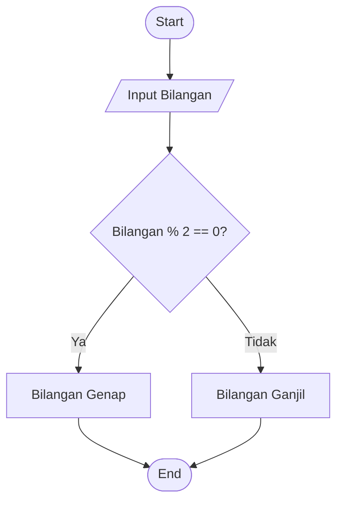

2# muhamad Nurul Bayan_algoritma_Pemograman
Tugas algoritma pemograman

##  Menentukan Bilangan Genap dan Ganjil

## A. Deskripsi Masalah

Dalam pembelajaran matematika, khususnya materi bilangan, bilangan bulat dapat dibedakan menjadi bilangan genap dan bilangan ganjil.

Bilangan yang habis dibagi 2 termasuk bilangan genap. Sedangkan bilangan yang tidak habis dibagi 2 termasuk bilangan ganjil.

Program ini menerapkan logika matematika untuk menentukan jenis bilangan berdasarkan kondisi yang diberikan. Program akan menerima sebuah bilangan bulat sebagai input, kemudian mengevaluasi apakah bilangan tersebut habis dibagi 2 atau tidak.

Berdasarkan hasil evaluasi tersebut, program akan menentukan apakah bilangan tersebut merupakan bilangan genap atau bilangan ganjil.

## B. Identifikasi Input, Proses, dan Output

| Komponen | Keterangan |
|---|---|
| **Input** | Sebuah bilangan bulat yang akan diperiksa. |
| **Proses** | Program memeriksa bilangan menggunakan operasi modulo (`MOD 2`). Jika sisa hasil pembagian dengan 2 adalah 0, maka bilangan tersebut genap. Jika sisanya bukan 0, maka bilangan tersebut ganjil. |
| **Output** | Jenis bilangan, yaitu **Bilangan Genap** atau **Bilangan Ganjil**. |

---


## C. Flowchart




## D. Implementasi Python


```python
bilangan = int(input("Masukkan sebuah bilangan: "))

if bilangan % 2 == 0:
    print("Bilangan Genap")
else:
    print("Bilangan Ganjil")
```


## E. Test Case

| Test Case | Input Bilangan | Kondisi | Hasil yang Diharapkan |
|------------|---------------|----------|----------------------|
| 1 | 12 | 12 % 2 = 0 | Bilangan Genap |
| 2 | 15 | 15 % 2 ≠ 0 | Bilangan Ganjil |

### F. Hasil Pengujian

**Test Case 1**

Input:
```text
12
```

Output:
```text
Bilangan Genap
```

**Test Case 2**

Input:
```text
15
```

Output:
```text
Bilangan Ganjil
```
## G. Hasil Pengujian

| No | Input Bilangan | Output Program | Status |
|----|---------------|----------------|--------|
| 1 | 12 | Bilangan Genap | ✅ Berhasil |
| 2 | 15 | Bilangan Ganjil | ✅ Berhasil |

## H. Hasil Pengujian


